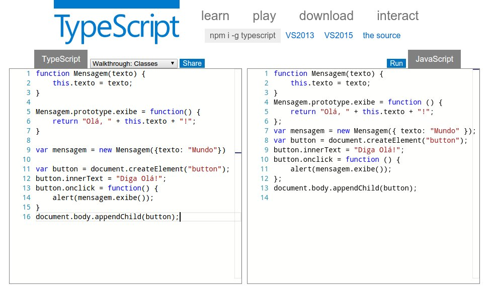
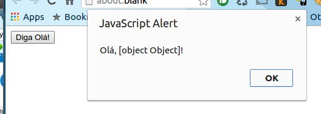
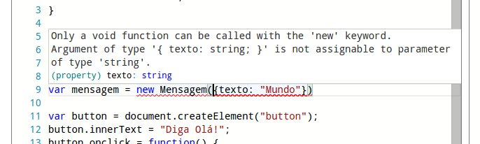
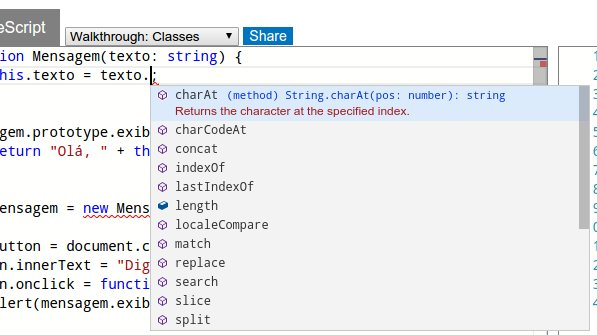

# Introdução ao TypeScript

## JavaScript no cenário atual

Com o crescimento da internet e a necessidade cada vez maior de termos aplicações web expondo funcionalidades complexas de usabilidade no lado cliente (frontEnd), têm se ampliando cada vez mais o uso do JavaScript para suportar toda esta infinidade de programação diretamente no navegador web.

Vemos que nos últimos anos nossos computadores ficaram mais rápidos, nossos navegadores ficaram mais rápidos e com isso o JavaScript também teve seu curso de evolução natural ficando mais rápido devido ao grande investimento em tecnologia feito nos compiladores e ganhando inúmeros recursos. Hoje podemos ver uma explosão de frameworks surgindo a todo momento, falamos sobre MVC e padrões de projeto dentre outros assuntos como se estivesse mos falando sobre linguagens clássicas como C++, Java ou C#. O JavaScript já ultrapassou as fronteiras da web e hoje podemos desenvolver aplicativos nativos para sistemas operacionais como no desenvolvimento de aplicativos para o Windows 8 por exemplo. Existem ainda outras técnologias tais como Adobe AIR, Titanium, PhoneGap, Chromium entre outros.

> [:memo: TODO] Citar a contribuição trazida pelo nodeJs e

> [:memo: TODO] Citar algumas aplicações notórioas desenvolvidas com Javascript

## Desenvolvendo aplicações em grande escala

Com todo esse crescimento provocado pela adoção do JavaScript vem surgindo a preocupação em como gerenciar todo o código fonte produzido permitindo escalar esta produção da mesma forma que já acontece em outras linguagens de programação. Foi pensando nisso que a Microsoft lançou o TypeScript. Seu intuito é de ampliar a escala de construção de aplicativos fornecendo recursos avançados de analise de tipagem estática. O TypeScript leva o JavaScript para mais próximo dos desenvolvedores familiarizados com o conceito de orientação a objetos como programadores das linguagens C#, C++ e Java entre outras.

> [:memo: TODO] Citar relação ente o TypeScript e o futuro do JavaScript (es6). Falar sobre como o TypeScript tem caminhado lado a lado com a especificação do es6

O TypeScript é um projeto OpenSource totalmente compatível com todos os navegadores e sistemas operacionais que já suportam o JavaScript. Na prática qualquer código JavaScript (com pequenos ajustes dependendo da complexidade deste código) pode ser utilizando dentro do TypeScript sendo que o resultado final será sempre JavaScript, com a facilidade de poder antecipar diversos erros que só pegaríamos testando a aplicação graças ao seu compilador dentre outras vantagens.

## JavaScript e TypeScript

Qualquer código JavaScript que você tenha desenvolvido pode ser facilmente trazido para o TypeScript, visto que o TypeScript adiciona sintaxe ao JavaScript não é necessário aprender toda uma nova sintaxe, basta entender os recxursos adicionados e como escrevê-los.

Como exemplo, considere o seguinte código JavaScript:

```javascript
function Mensagem(texto) {
    this.texto = texto;
}

Mensagem.prototype.exibe = function() {
    return "Olá, " + this.texto + "!";
}

var mensagem = new Mensagem({texto: "Mundo"})

var button = document.createElement("button");
button.innerText = "Diga Olá!";
button.onclick = function() {
    alert(mensagem.exibe());
}
document.body.appendChild(button);
```

Vamos compilar este código com o compilador do TypeScrit para visualizar o código JavaScrit que será gerado. Para isso vamos utilizar o [TypeScript Playground](http://www.typescriptlang.org/Playground). Trata se de um compilador TypeScript online onde podemos testar qualquer código TypeScript e visualizar a saída de código JavaScript em tempo real.



Veja que na caixa a esquerda temos nosso código JavaScript original. Já na caixa a direita temos o código gerado pelo compilador do TypeScript, e você vai perceber que a saída de código é essencialmente parecida com o código JavaScript que foi introduzido, tirando algumas pequenas diferenças de espaço em branco que foram removidos.

No entanto esse código JavaScript tem um bug. Devido a natureza dinâmica do JavaScrpt este bug passou despercebido durante o desenvolvimento deste código. Basta executar o código e veremos o erro ocorrendo:



Veja que o construtor do objeto `Mensagem` esperava um argumento do tipo string mas o argumento passado foi um objeto. Esse erro poderia ter sido facilmente evitado se tivéssemos utilizado o recurso de definição de tipos do TypeScript _(Type Anotations :memo: - referênciar a documentação oficial se possível)_. Para tanto vamos alterar o código original e definir para o construtor do objeto `Mensagem` que seu argumento deverá ser sempre do tipo string. Segue abaixo o código alterado:

```typescript
function Mensagem(texto: string) {
    this.texto = texto;
}

Mensagem.prototype.exibe = function() {
    return "Olá, " + this.texto + "!";
}

var mensagem = new Mensagem({texto: "Mundo"})

var button = document.createElement("button");
button.innerText = "Diga Olá!";
button.onclick = function() {
    alert(mensagem.exibe());
}
document.body.appendChild(button);
```

Ao tentar compilar este código o compilador do TypeScript nos dará um erro na linha 9 por que estamos tentando passar um objeto como argumento de um construtor que espera receber um argumento do tipo `string` conforme foi definido. Vamos utilizar o TypeScript Playground para ver isso na prática.



Após alterarmos o código na linha 1 definindo o tipo do argumento como texto o TypeScript passou a emitir um erro na linha 9.

Veja que esta simples definição de tipo permitiu ao compilador nos fornecer uma experiência de codificação muito melhor do que a que tivemos antes. Agora temos uma verificação estática do nosso código e um erro totalmente detalhado. com esse tooling a disposição conseguimos facilmente identificar e resolver o problema que antes havia passado despercebido.

Com uma definição de tipos bem feita podemos ter um intellisense (auto complete) de qualidade se estivermos utilizando uma IDE com bom suporte ao TypeScript _(:memo: Criar uma seção sobre as IDEs que suportam TypeScript e referÇencias eswta seção aqui)_. Veja por exemplo na imagem abaixo um autocomplete gerado quando tentamos acessar os membros do argumento texto da função `Mensagem`.



O TypeScript também nos permite adicionar tipagem estática para um código JavaScript sem que tenhamos a necessidade de alterar o código original. Isso é muito útil quando queremos utilizar um framework javascript que não está escrito em TypeScript como o [JQuery](https://github.com/borisyankov/DefinitelyTyped/blob/master/jquery/jquery.d.ts) por exemplo. Irei cobrir com detalhes a construção de arquivos de definição em outra seção.

> [:memo: TODO] - Falta finalizar e concluir o capítulo
