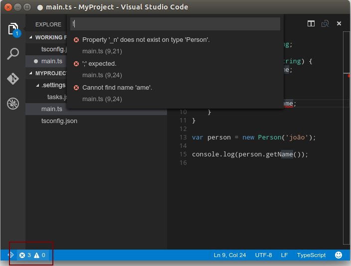

# Usando o VSCode (Visual Studio Code)

O VSCode é um editor multiplataforma criado pela Microsoft. O Visual Studio Code foi criado usando uma mistura de tecnologias de código aberto e baseadas na web, como o Chromium, o Electron app framework do GitHub, e próprio editor Monaco, da Microsoft. Trata-se de um editor de código, não espere encontrar uma IDE super completa como o Visual Studio, mas mesmo sendo um editor o VSCode surpreende muito com seus recursos e suporte a programação com todfas as caracteristicas de um bom editor.

> Para facilitar a escrita a partir de agora sempre irei me referir ao visual Studio Code simplesmente como VSCode.

## Instalando o VSCode

Para instalar o VSCode acesse a página do projeto https://www.visualstudio.com/en-us/products/code-vs.aspx e vá até a seção Download. Selecione a versão do seu sistem operacional e sigua as isntruções de instalação.

## Criando o primeiro projeto TypeScript

Neste pequeno tutorial iremos criar um projeto TypeScript simples (NOTA: No momento em que esta seção está sendo escrita o VSCode suportar a versão `1.5-beta` do TS).

Para iniciar crie um novo diretório chamado `MyProject`.

```shell
mkdir MyProject
```

Abra o VSCode e abra o diretório MyProject de dentro do VSCode.


Agora, usando o sidebar Explorer, vamos adicionar um novo arquivo chamado `tsconfig.json`.


Digite `{ }` e com o cursor no meio das chaves pessione Ctrl+SPACE para abrir as opções disponíveis:


Selecione `compilerOptions` e pressione ENTER. Vamos configurar o output do projeto para ES5, modulo do tipo AMD e emissão de source maps.

```json
{
	"compilerOptions": {
		"target": "ES5",
		"module": "amd",
		"sourceMap": true
	}
}
```

Agora vamos adicionar um novo arquivo chamado `main.ts`. Adicione o seguinte código:

```typescript
class Person {
    private _name: string;

    constructor(name: string) {
        this._name = name;
    }

    public getName() {
        return this._name;
    }
}

var person = new Person('joão');

console.log(person.getName());
```

Tente compilar o projeto teclando `Ctrl-Shift-B`. Note que o VSCode irá exibir uma mensagem dizendo que não temos uma `task` configurada para o nosso projeto _(:memo: TODO - explicar o que são as tasks do VSCode)_.


Clique em `Configure Task Runner` para adicionar uma nova task. um novo arquivo chamado `tasks.json` será criado. Altere a linha que contém a chave `"args": ["HelloWorld.ts"]` para `"args": []` e em seguida tente compilar o projeto novamente utilizando `Ctrl-Shift-B`. O VSCode irá indicar na barra de status o status da compilação.


Note que caso existam erros os memos serão indicados nada barra de status e você poderá clicar em cima do indicador para obter mais detalhes.



> NOTA: O VSCode está na versão preview atualmente e alguns procedimentos poderão ser alterados com forme novas versões forem lançadas.

Após a compilação o VSCode irá gerar os arquivos `main.js` e `main.js.map`. Trata-se do arquivo JavaScript gerado e do arquivo source map. Agora você pode utilizar o node via linha de comando para executar o código do arquivo main.js.

```shell
node main.js
```


